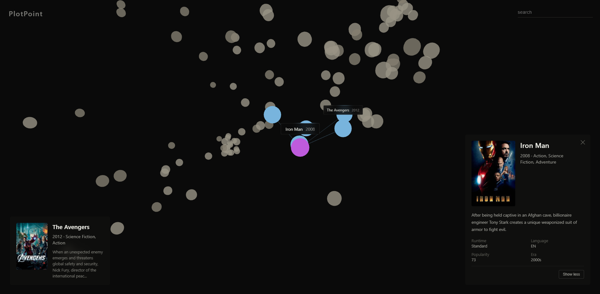

# 🎬 PlotPoint

> **Explore cinema by proximity**

PlotPoint is an interactive 3D visualization where movies exist as points in space. **Proximity means similarity** — movies with similar themes, genres, and vibes cluster together naturally. No algorithms telling you what to watch. Just explore.



---

## ✨ The Experience

PlotPoint is **not** a recommendation engine. It's a **semantic universe of stories**.

- **Hover** over any point → see the movie poster, title, year, genres
- **Click** a movie → camera flies to it, reveals the 5 nearest neighbors connected by lines
- **Search** for a movie → instantly navigate to it in 3D space
- **Explore** clusters naturally — crime thrillers from Hollywood and Bollywood sit next to each other

**Discovery > accuracy. Feeling > metrics.**

---

## 🎯 What Makes Movies "Close"?

Two movies are near each other if they share:
- Genre and tone
- Themes and motifs
- Franchise / production company
- Era (decade)
- Cultural adjacency (language, region)

**Not** based on: budget, revenue, marketing, or box office performance.

---

## 🛠 Technical Architecture

### Data Pipeline (Python)

1. **Filter** 1.3M movies → 3,000 quality entries (vote_count ≥ 500, has overview/genres)
2. **Normalize** metadata (genres, keywords, era buckets, runtime categories)
3. **Generate embeddings** using `all-mpnet-base-v2` (384-dimensional semantic vectors)
4. **Validate** that similar movies are actually close (Inception near Interstellar, MCU movies cluster)
5. **Reduce dimensions**: Embeddings → PCA (50D) → UMAP (3D) with cosine distance
6. **Cluster** with HDBSCAN for soft groupings

### Embedding Schema

Each movie is embedded using structured text (not raw plot dumps):

```
Title: {title}
Genres: {up to 3 genres}
Themes: {top 5-8 keywords}
Era: {1990s / 2000s / 2010s / 2020s}
Language: {original_language}
Production: {top production company}
Runtime: {Short | Standard | Long}
Summary: {ONE concise sentence}
```

This prevents "narrative dominance" where plot details override thematic similarity.

### Web App (React + Three.js)

- **React Three Fiber** for declarative 3D
- **3,000 individual mesh spheres** (not point cloud — enables proper click detection)
- **K-D Tree** spatial index for O(log n) nearest-neighbor queries
- **Smooth camera flights** with OrbitControls integration
- **TMDB posters** loaded on hover/select

---

## 📁 Project Structure

```
PlotPoint/
├── data_pipeline/
│   ├── src/
│   │   ├── 01_filter_sample.py    # Filter 1.3M → 3K movies
│   │   ├── 02_normalize.py        # Clean genres, keywords, eras
│   │   ├── 03_generate_embeddings.py  # Sentence transformers
│   │   ├── 04_validate.py         # Check embedding quality
│   │   └── 05_reduce_and_cluster.py   # PCA → UMAP → HDBSCAN
│   ├── data/
│   │   ├── input/                 # Raw movies.csv (not in repo)
│   │   └── output/                # plotpoint_data_3d.json
│   └── requirements.txt
│
├── web_app/
│   ├── src/
│   │   ├── components/
│   │   │   ├── Scene.jsx          # 3D visualization
│   │   │   ├── HoverPanel.jsx     # Left panel on hover
│   │   │   ├── MovieFocus.jsx     # Right panel on select
│   │   │   └── Search.jsx         # Search input
│   │   ├── utils/
│   │   │   └── KDTree.js          # Spatial index
│   │   └── App.jsx
│   ├── public/
│   │   └── plotpoint_data_3d.json # Generated data
│   └── package.json
│
└── README.md
```

---

## 🚀 Getting Started

### Prerequisites
- Python 3.9+
- Node.js 18+
- ~2GB RAM for embeddings

### 1. Data Pipeline

Download [The Movies Dataset](https://www.kaggle.com/datasets/rounakbanik/the-movies-dataset) and place `movies_metadata.csv` in `data_pipeline/data/input/movies.csv`.

```bash
cd data_pipeline

# Create virtual environment
python -m venv .venv
.\.venv\Scripts\Activate  # Windows
# source .venv/bin/activate  # Mac/Linux

# Install dependencies
pip install -r requirements.txt

# Run pipeline steps
python src/01_filter_sample.py
python src/02_normalize.py
python src/03_generate_embeddings.py
python src/04_validate.py
python src/05_reduce_and_cluster.py
```

Output: `data_pipeline/data/output/plotpoint_data_3d.json`

### 2. Web App

```bash
cd web_app

# Install dependencies
npm install

# Copy generated data
Copy-Item ..\data_pipeline\data\output\plotpoint_data_3d.json public\  # Windows
# cp ../data_pipeline/data/output/plotpoint_data_3d.json public/  # Mac/Linux

# Run dev server
npm run dev
```

Open http://localhost:5173

### 3. Deploy

```bash
cd web_app
vercel
```

Set root directory to `web_app` in Vercel settings.

---

## 🎨 Visual Design

PlotPoint follows a **museum installation** aesthetic, not typical web app design:

- **Muted, cinematic colors** — earthy grays that shift by era
- **Progressive reveal** — information appears on interaction, not all at once
- **Spatial feedback**:
  - Hover → Yellow (#facc15) + left panel
  - Select → Purple (#a855f7) + right panel + 5 nearest neighbors in blue
- **Frosted glass panels** with subtle blur
- **Minimal chrome** — the 3D space is the interface

---

## 🔮 Future Ideas

- [ ] TV shows in the same space (toggle on/off)
- [ ] Time slider to filter by decade
- [ ] "Surprise me" button — random teleport
- [ ] Shareable links to specific movies
- [ ] Compare two movies side-by-side

---

## 📊 Technical Specs

| Component | Technology |
|-----------|------------|
| Embeddings | `sentence-transformers/all-mpnet-base-v2` |
| Dimensionality Reduction | PCA (384→50) + UMAP (50→3) |
| Clustering | HDBSCAN |
| 3D Rendering | React Three Fiber + Three.js |
| Spatial Index | Custom K-D Tree |
| Styling | Inline styles (museum aesthetic) |
| Deployment | Vercel |

---

## 🙏 Credits

- Movie data from [TMDB](https://www.themoviedb.org/) via [Kaggle](https://www.kaggle.com/datasets/rounakbanik/the-movies-dataset)
- Embeddings by [Sentence Transformers](https://www.sbert.net/)
- 3D powered by [Three.js](https://threejs.org/) and [React Three Fiber](https://docs.pmnd.rs/react-three-fiber)

---

*"I didn't expect that to be nearby — but it makes sense."*
